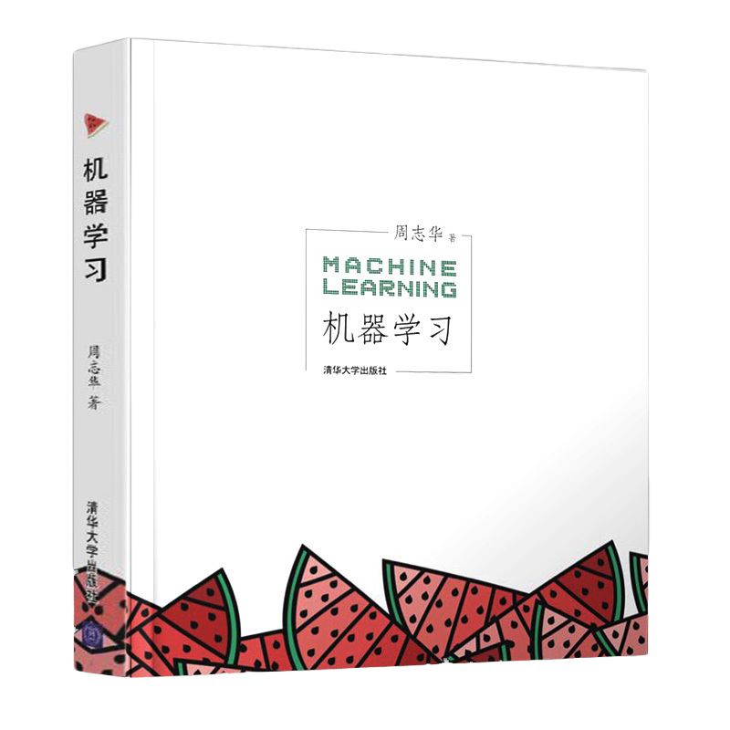

# MachineLearningMaterials
Machine learning references and reading notes
周志华-西瓜书 参考文献及阅读笔记整理

### 一、仓库介绍及由来

​		本仓库为阅读周志华教授《机器学习》后，深感意犹未尽，横竖翻看，终于在看起来不太起眼的地方，找到每一章节背后的参考文献，因此心生一想法——作为读者来说，带着问题去书中寻找答案，在辩证思考与寻找的过程即为与作者思维碰撞的过程。那么换个角度来说，若假设自己是作者，需要将一系列晦涩抽象且难懂的知识和内容，整合成能够被读者接受的这样一本书，这中间的过程必然也是艰辛而深刻的。同时，读文献与写总结记录是一个枯燥而费神的事情，但倘若能迎难而上，站在前人的肩膀上踩着前辈们留下的脚步印记，重新回顾自机器学习发展以来至今日的众多想法、方案及其思路，那也将是一件有趣的事情。

​		由此以上想法，不才便斗胆尝试，小心实践。
​		目前计划如下：
​		1.通过Google Scholar以及Sci-hub等途径，对书中参考文献进行整理和按照章节分类。(进行中)
​		2.根据每章章节结合《统计学习方法》等书籍进行对照学习，并整理相应的学习笔记。
​		3.以参考文献在书中的引用部分作为文献阅读的定位点，阅读作者在参考文献中剩余未引用或未论述的部分，以此作为阅读笔记的补充。

