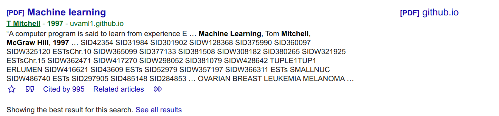
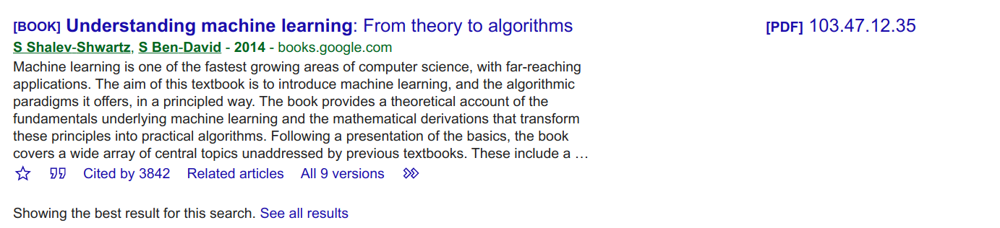

# 第一章 绪论 

## 文献检索汇总：

### 1.Alpaydin E(2004).Introduction to Machine Learning. MIT Press mariage MA

### 2.Asmis E(1984).Epicurus Scientific Method. Cornell University Press Ithaca

### 3.Bishop C M.(2006). Pattern Recognition and Machine Learning. Springer New York. NY

### 4.Blumer A A. Ehrenfeucht D Haussler and M. K. Warmuth.(1996).Oc- cam s razor Information Processing Letters 24(6) 377-380

### 5.Carbonell J G ed (1990). Machine Learning Paradigms and Methods. MIT Press Cambridge MA

### 6.Cohen P. R. and E A. Feigenbaum eds(1983). The Handbook of Artificial Intelligence volume 3. William Kaufmann. New York. NY

### 7.Dietterich. T. G.(1997). Machine learning research Four current directions AI Magazine 18(4) 97-136

### 8.Domingos P (1999). The role of Occams razor in knowledge discovery. Data Mining and Knowledge Discovery 3(4) 409-425 .png

### 9.Duda R O P. E. Hart and D. G. Stork(2001). Pattern Classification 2nd edition. John Wiley &Sons New York NY. .png

### 10.Flach P (2012). Machine Learning The Art and Science of Algorithms that Make Sense of Data. Cambridge University Press Cambridge UK

### 11.Hand D H Mannila and P Smyth (2001). Principles of Data Mining. MIT Press. Cambridge MA 

### 12.Hastie T R. Tibshirani and J. Friedman(2009). The Elements of Statistical Learning 2nd edition. Springer New York NY

### 13.Hunt E. G and D I Hovland. (1963).Programming a model of human con- cept formation.  In Computers and Thought(E Feigenbaum and J. Feldr eds ) 310-325 MCGRAW Hill New York NY

### 14.Kanerva P(1988).Sparse Distributed Memory. MIT Press Cambridge MA 

### 15.michalski R S J. G. Carbonell and T M. Mitchell eds (1983 ). Machine Learning An Artificial Intelligence Approach. Tioga Palo Alto CA

### 16.Mitchell T (1997) Machine Learning. Mcgraw Hill New York NY

### 17.Mjolsness E and D. Decoste.(2001).Machine learning for science State of the art and future prospects.  Science 293(5537) 2051-2055 

### 18.Machine learning for science State of the art and future prospects

### 19.Pan S J and Q. Yang(2010) A survey of transfer learning.  IEEE Trans actions on Knowledge and Data Engineering 22(10) 1345-1359

### 20.Shalev-shwartz S and S Ben-david (2014). Understanding Machine Learn ing. Cambridge University Press Cambridge UK 

### 21.Simon H. A. and G. Lea(1974).Problem solving and rule induction A unified view. In Knowledge and Cognition (L W. Gregg ed. ) 105-127 Erlbaum. New York. NY

### 22.Vapnik V N (1998). Statistical Learning Theory. Wiley New York NY

### 23.Webb G I(1996)Further experimental evidence against the utility of Oc- cams razor. Journal of Artificial Intelligence Research 43 397-417

### 24.Winston P H(1970).Learning structural descriptions from examples. Tech- nical Report AI-TR-231 A Lab MIT Cambridge MA 

### 25.Practical Machine Learning Tools and Techniques

### 26.Wolpert D. H (1996).The lack of a priori distinctions between learning al- gorithms.  Neural Computation 8(7) 1341-1390 

### 27.Wolpert D H. and W. G. Macready. (1995). No free lunch theorems fo search. Technical Report SFT-TR-05-010 Santa Fe Institute Sante Fe NM 

### 28.(2003).Three perspectives of data mining. Artificial Intelligence 143(1)139-146

## 参考文献汇总：

| 序号 | 作者                                                         | 内容名称                                                     | 出版                                                         | PDF名称                                                      |
| ---- | ------------------------------------------------------------ | ------------------------------------------------------------ | ------------------------------------------------------------ | ------------------------------------------------------------ |
| 1    | Alpaydin, E (2004).                                          | Introduction to Machine Learning                             | MIT Press, Cambridge MA                                      | i2ml-figs.pdf                                                |
| 2    | Asmis, E(1984).                                              | Epicurus Scientific Method                                   | Cornell University Press, Ithaca                             | Epicurus Scientific Method.pdf                               |
| 3    | Bishop, C M.(2006).                                          | Pattern Recognition and Machine Learning.                    | Springer, New York. NY                                       | Bishop - Pattern Recognition and Machine Learning.pdf        |
| 4    | Blumer, A, A Ehrenfeucht, D. Haussler, and M. K. Warmuth (1996). | Occam’s razor                                                | Information Processing Letters, 24(6): 377-380               | occam.pdf                                                    |
| 5    | Carbonell, J G, ed (1990).                                   | Machine Learning: Paradigms and Methods.                     | MIT Press, ambridge. MA                                      | Paradigms and Methods.pdf                                    |
| 6    | Cohen, P. R. and E A.Feigenbaum, eds (1983).                 | The Handbook of Artificial Intelligence, volume 3.           | William Kaufmann. New York. NY                               | handbookofartific04barr                                      |
| 7    | Dietterich, T. G. (1997).                                    | Machine learning research: Four current directions           | AI Magazine 18(4): 97-136                                    | 1324-Article Text-1321-1-10-20080129.pdf                     |
| 8    | Domingos, P (1999).                                          | The role of Occam's razor in knowledge discovery             | Data Mining and Knowledge Discovery, 3(4): 409-425           | dmkd99.pdf                                                   |
| 9    | Duda, R O, P. E. Hart, and D. G. Stork(2001).                | Pattern Classification                                       | John Wiley &Sons, New York, NY.                              | DHSAppendix-with-cover-page-v2                               |
| 10   | Flach, P (2012).                                             | Machine Learning: The Art and Science of Algorithms that Make Sense of Data | Cambridge University Press, Cambridge, UK                    | W02.pdf                                                      |
| 11   | Hand, D, H Mannila, and P Smyth (2001).                      | Principles of Data Mining                                    | MIT Press, Cambridge, MA                                     | Principles of Data Mining Hand Mannila & Smyth 2001-08-01.pdf |
| 12   | Hastie, T, R. Tibshirani, and J.Friedman(2009).              | The Elements of Statistical Learning                         | Springer, New York, NY.                                      | insr12167.pdf                                                |
| 13   | Hunt, E. G and D I Hovland.(1963).                           | Progral mming a model of human co cept formation.            | In Computers and Thought(E Feigenbaum and J. Feldman, eds ) 310-325 MCGRAW Hill, New York, NY | hunt1961.pdf                                                 |
| 14   | Kanerva, P(1988).                                            | Sparse Distributed Memory                                    | MIT Press, Cambridge, MA                                     | NNPrsntnJP1.pdf                                              |
| 15   | michalski, R S, J. G. Carbonell, and T M.                    | Mitchell, eds (1983 ). Machine Learning: An Artificial Intelligence Approach | Tioga, Palo Alto, CA                                         | mlaias.pdf                                                   |
| 16   | Mitchell, T (1997).                                          | Machine Learning                                             | Mcgraw Hill, New York, NY                                    | 1.2_WhatIsMachineLearning.pdf                                |
| 17   | Mitchell, T M.(1977).                                        | A candidate elimination approach to rule learning            | In Proceedings of the 5th International Joint Conference on Artificial Intelligence(IJCAI) 305-310, Cambridge, MA | aceatrl.pdf                                                  |
| 18   | Mjolsness, E and D. Decoste.(2001).                          | Machine learning for science: State of the art and future prospects. | Science, 293(5537): 2051-2055                                | 10.1.1.1079.2602.pdf                                         |
| 19   | Pan, S J. and Q. Yang(2010)                                  | A survey of transfer learning                                | IEEE Trans actions on Knowledge and Data Engineering, 22(10): 1345-1359 | tkde_transfer_learning.pdf                                   |
| 20   | Shalev-shwartz, S and S Ben-david (2014).                    | Understanding Machine Learning.                              | Cambridge University Press, Cambridge, UK                    | understanding-machine-learning-theory-algorithms             |
| 21   | Simon, H. A. and G. Lea(1974).                               | Problem solving and rule induction: A unified view.          | In Knowledge and Cognition (L W. Gregg, ed. ) 105-127 Erlbaum. New York. NY | qv796fc9687.pdf                                              |
| 22   | Vapnik, V N (1998).                                          | Statistical Learning Theory.                                 | Wiley, New York, NY                                          | 10.1.1.332.356.pdf                                           |
| 23   | Webb, G I(1996).                                             | Further experimental evidence against the utility of Oc- cams razor. | Journal of Artificial Intelligence Research, 43: 397-417.    | 10168-Article Text-18545-1-10-20180216.pdf                   |
| 24   | Winston, P H(1970).                                          | Learning structural descriptions from examples               | Tech- nical Report AI-TR-231, A Lab, MIT, Cambridge, MA      | AITR-231.pdf                                                 |
| 25   | Witten, I H, E.Frank, and M. A Hall(2011)                    | Data Mining: Practical Ma chine Learing Tools and Technigues, 3rd edition. | Elsevier, Burlington, MA                                     | Chapter6.pdf                                                 |
| 26   | Wolpert, D. H(1996).                                         | The lack of a priori distinctions between learning al gorithms. | Neural Computation, 8(7): 1341-1390                          | 10.1.1.390.9412.pdf                                          |
| 27   | Wolpert, D H. and W. G. Macready. (1995).                    | No free lunch theorems fo search.                            | Technical Report SFT-TR-05-010, Santa Fe Institute, Sante Fe, NM | No_Free_Lunch_Theorems_for_Search.pdf                        |
| 28   | Zhou, Z -H(2003).                                            | Three perspectives of data mining.                           | Artificial Intelligence 143(1):139-146.                      | 1-s2.0-S0004370202003570-main.pdf                            |

"注:(此处是在查询资料时发现的意外收获，整理如下)
[6] AI Hand http://aihandbook.intsys.org.ru/index.php
[16] Lectures and slides for the UvA Master AI course Machine Learning 1 https://uvaml1.github.io/